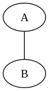
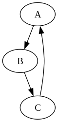
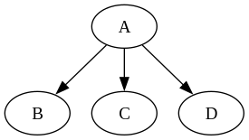
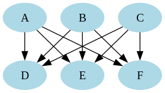
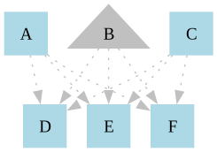
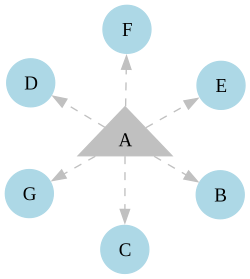

# Graphviz is open source graph visualization software.

# Graphviz Project

This repository contains a collection of Graphviz source files (`.gv`) and their corresponding output images (`.png`).

## Directory Structure

```
├── LICENSE
├── README.md
├── src
│   ├── 1.gv
│   ├── 2.gv
│   ├── 3.gv
│   ├── 4.gv
│   ├── 5.gv
│   ├── 6.gv
│   └── 7.gv
└── target
    ├── 01.png
    ├── 02.png
    ├── 03.png
    ├── 04.png
    ├── 05.png
    ├── 06.png
    └── 07.png
```

## Graphs Overview

Below are the source codes along with their corresponding outputs:

### Graph 1

**Source (`src/1.gv`):**
```dot
// Add the content of 1.gv here
```

**Output (`target/01.png`):**


---

### Graph 2

**Source (`src/2.gv`):**
```dot
// Add the content of 2.gv here
```

**Output (`target/02.png`):**


---

### Graph 3

**Source (`src/3.gv`):**
```dot
// Add the content of 3.gv here
```

**Output (`target/03.png`):**


---

### Graph 4

**Source (`src/4.gv`):**
```dot
// Add the content of 4.gv here
```

**Output (`target/04.png`):**


---

### Graph 5

**Source (`src/5.gv`):**
```dot
// Add the content of 5.gv here
```

**Output (`target/05.png`):**


---

### Graph 6

**Source (`src/6.gv`):**
```dot
// Add the content of 6.gv here
```

**Output (`target/06.png`):**


---

### Graph 7

**Source (`src/7.gv`):**
```dot
// Add the content of 7.gv here
```

**Output (`target/07.png`):**


---

## How to Generate Graphs

To generate PNG files from the Graphviz `.gv` files, use the following command:

```sh
dot -Tpng src/1.gv -o target/01.png
```

Replace `1.gv` and `01.png` with the appropriate filenames for other graphs.

## License

This project is licensed under the terms specified in the `LICENSE` file.

Make sure to replace the `// Add the content of X.gv here` placeholders with the actual Graphviz code from your files. Let me know if you need any modifications! 🚀
