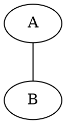
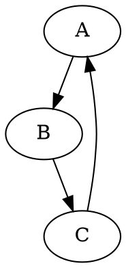
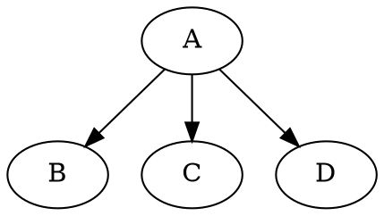
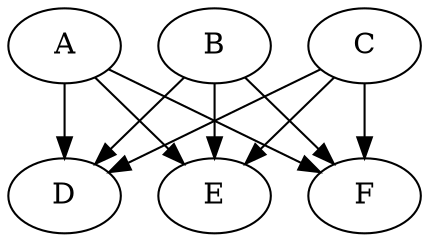
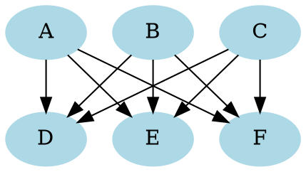
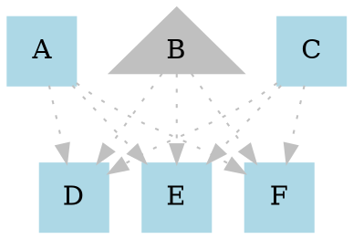
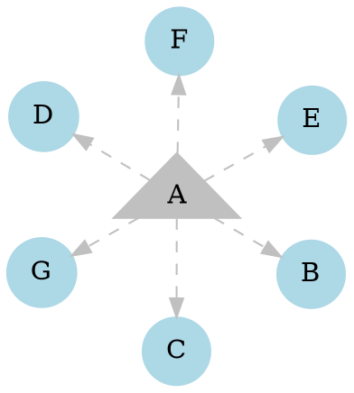

# Graphviz Examples with Directory Structure
Graphviz is open source graph visualization software. This repository contains a collection of Graphviz source files (`.gv`) and their corresponding output images (`.png`).

## Directory Structure

```
├── LICENSE
├── README.md
├── src  # source code goes here
│   ├── 1.gv
│   ├── 2.gv
│   ├── 3.gv
│   ├── 4.gv
│   ├── 5.gv
│   ├── 6.gv
│   └── 7.gv
└── target # all the outputs
    ├── 01.png
    ├── 02.png
    ├── 03.png
    ├── 04.png
    ├── 05.png
    ├── 06.png
    └── 07.png
```

## Examples

Below are the source codes along with their corresponding outputs:

### Graph 1

**Source (`src/1.gv`):**


**Output (`target/01.png`):**


---

### Graph 2

**Source (`src/2.gv`):**


**Output (`target/02.png`):**


---

### Graph 3

**Source (`src/3.gv`):**


**Output (`target/03.png`):**


---

### Graph 4

**Source (`src/4.gv`):**


**Output (`target/04.png`):**


---

### Graph 5

**Source (`src/5.gv`):**


**Output (`target/05.png`):**


---

### Graph 6

**Source (`src/6.gv`):**


**Output (`target/06.png`):**


---

### Graph 7

**Source (`src/7.gv`):**


**Output (`target/07.png`):**

---

## How to Generate Graphs

To generate PNG files from the Graphviz `.gv` files, use the following command:

```bash
dot -Tpng src/<file.gv> -o target/<output.png>
```

Replace `file.gv` and `output.png` with the appropriate filenames for other graphs.


