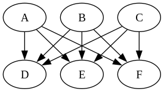
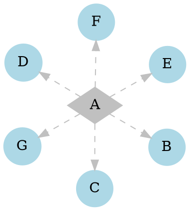
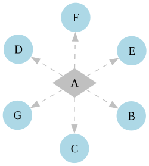
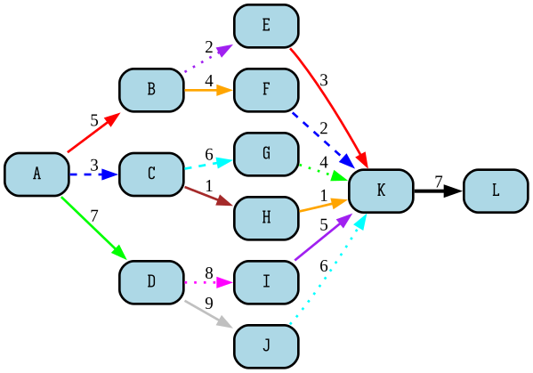

# Graphviz Examples with Directory Structure
Graphviz is open source graph visualization software. This repository contains a collection of Graphviz source files (`.gv`) and their corresponding output images (`.png`).

## Directory Structure

```
.
├── src  # source code goes here
│   ├── 1.gv
│   ├── 2.gv
│   ├── 3.gv
│   ├── 4.gv
│   ├── 5.gv
│   ├── 6.gv
│   ├── 7.gv
│   └── 8.gv
└── target # all the outputs
    ├── 01.png
    ├── 02.png
    ├── 03.png
    ├── 04.png
    ├── 05.png
    ├── 06.png
    ├── 07.png
    └── 08.png
```

## Examples

Below are the source codes along with their corresponding outputs:

### Graph 1

**Source (`src/1.gv`):**


**Output (`target/01.png`):**


---

### Graph 2

**Source (`src/2.gv`):**


**Output (`target/02.png`):**


---

### Graph 3

**Source (`src/3.gv`):**


**Output (`target/03.png`):**


---

### Graph 4

**Source (`src/4.gv`):**


**Output (`target/04.png`):**


---

### Graph 5

**Source (`src/5.gv`):**


**Output (`target/05.png`):**


---

### Graph 6

**Source (`src/6.gv`):**


**Output (`target/06.png`):**


---

### Graph 7

**Source (`src/7.gv`):**


**Output (`target/07.png`):**

---
### Graph 8

**Source (`src/8.gv`):**
```
digraph BeautifulGraph {
    rankdir=LR;
    splines=true;
    overlap=false;
    
    node [shape=rect, style=filled, fillcolor=lightblue, fontname="IosevkaTermSlab Nerd Font", penwidth=2, style="rounded,filled"];

    A -> B [label="5", color=red, penwidth=2.0];
    A -> C [label="3", color=blue, penwidth=2.0, style=dashed];
    A -> D [label="7", color=green, penwidth=2.0];

    B -> E [label="2", color=purple, penwidth=2.0, style=dotted];
    B -> F [label="4", color=orange, penwidth=2.0];

    C -> G [label="6", color=cyan, penwidth=2.0, style=dashed];
    C -> H [label="1", color=brown, penwidth=2.0];

    D -> I [label="8", color=magenta, penwidth=2.0, style=dotted];
    D -> J [label="9", color=gray, penwidth=2.0];

    E -> K [label="3", color=red, penwidth=2.0];
    F -> K [label="2", color=blue, penwidth=2.0, style=dashed];
    G -> K [label="4", color=green, penwidth=2.0, style=dotted];
    H -> K [label="1", color=orange, penwidth=2.0];
    I -> K [label="5", color=purple, penwidth=2.0];
    J -> K [label="6", color=cyan, penwidth=2.0, style=dotted];

    K -> L [label="7", color=black, penwidth=3.0];

    {rank=same; B; C; D}
    {rank=same; E; F; G; H; I; J}
}
```
**Output (`target/08.png`):**

---

## How to Generate Graphs

To generate PNG files from the Graphviz `.gv` files, use the following command:

```bash
dot -Tpng src/<file.gv> -o target/<output.png>
```

Replace `file.gv` and `output.png` with the appropriate filenames for other graphs.


